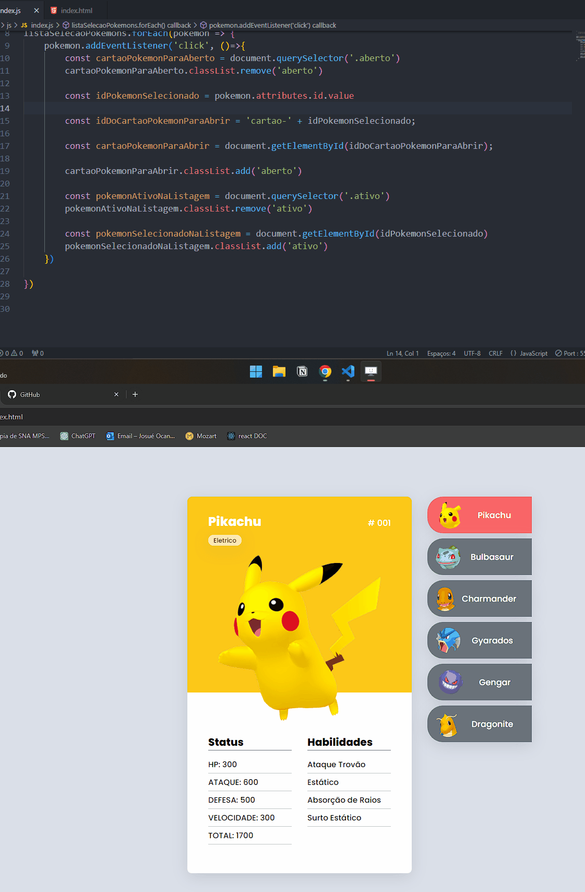

# DevQuest - Mapa Dev Week -Workshop
## Quest - Pokedex, introdução a programação

### [Deploy](https://josuecosta2023.github.io/DeQuest-mapDev-pokedex/)

# Desafio: 
* Pokedex.
* Website Responsivo
* Conteudo dinâmico, assim que o usuário clicar em um pokemon da lista, o card deve mudar de acordo com o item clicado.

## Maior dificuldade:
* Lógica Javascript

## O que aprendi?
* A me organizar para encarar desafios de programação.
    * Escreva a rotina que será necessária.
    * Após pense em quais variáveis criar, loops e sistemáticas que serão necessárias para cumprir o objetivo.
    * Faça uma parte de cada vez.

## Linguagens e sostwares utilizados
* HTML
* CSS
* JAVASCRIPT
* GIT
* GITHUB

### Screenshots
#### Visualização Desktop

# Author
### Josué Ocanha Costa
#### FrontEnd Developer
#### Redes Sociais

- Linkedin - [JosueOcanhaCosta](https://www.linkedin.com/in/josue-ocanha-costa/)
- Github - [JosueCosta2023](https://github.com/JosueCosta2023)
- Twitter - [@JosueOcanhaCosta](https://twitter.com/josue_ocanha)
- Facebook - [JosueCosta](https://www.facebook.com/JosueOcanhaCosta2023)
- Whatsapp - [Josue2023](https://wa.me/5565996408371?text=Ol%C3%A1%2C+encontrei+seu+whatsapp+no+Github.+Gostaria+de+falar+sobre+seus+projetos.)

# "Vida longa e próspera. 🖖🖖🖖"